# ✈️ AirBooking Frontend (React)


## 🧭 Project Overview

AirBooking Frontend is a modern flight booking interface built using **React.js**, designed for smooth user interaction and real-time data fetching from the Django backend API.

### ✨ Features
- Search, book, and manage flights
- User authentication & profile management
- Payment integration via Stripe (Test Mode)
- Responsive and interactive UI
- Reusable React components
- API integration with Django backend

---

## ⚙️ Setup Instructions (Frontend)

### 1️⃣ Clone the Repository
```bash
git clone https://github.com/catipamula/flightmanagementfrontend.git
cd airbooking-frontend
```

### 2️⃣ Install Dependencies
```bash
npm install
```

### 3️⃣ Configure Environment Variables
Create a `.env` file in the root folder:
```
REACT_APP_BACKEND_URL=http://127.0.0.1:8000
REACT_APP_STRIPE_PUBLIC_KEY=pk_test_51QNszREOpq520XH9eMo4zIn8a0qGkk8V9WceLvS5UDIyXNnei6V57ixBDh2xW59NpElQVVQSLmNsrP08FDtEhQz1002qjylZfb
```

### 4️⃣ Run the Frontend
```bash
npm start
```

---

## 🧩 API Endpoints (Connected with Backend)

| Endpoint | Method | Description |
|-----------|---------|-------------|
| `/api/flights/` | GET | Get available flights |
| `/api/book/` | POST | Book a flight |
| `/api/my-trips/` | GET | Fetch user bookings |
| `/api/create-payment/` | POST | Create Stripe Payment Intent |

---


---

## 🖼️ Screenshot Preview

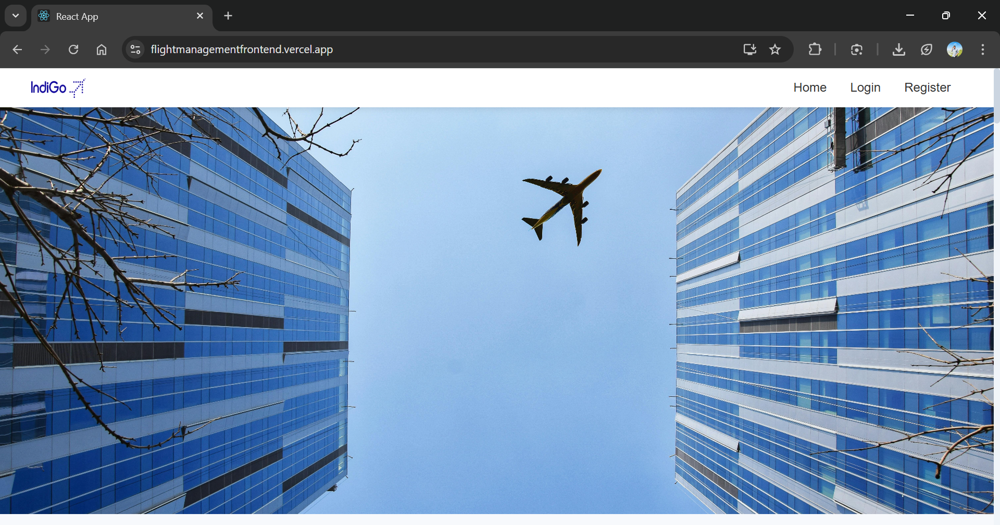
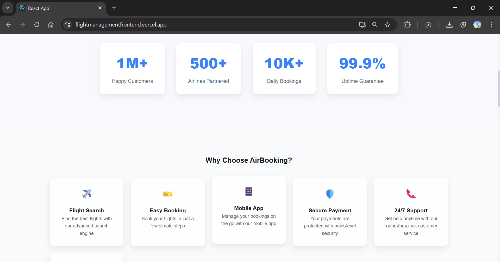
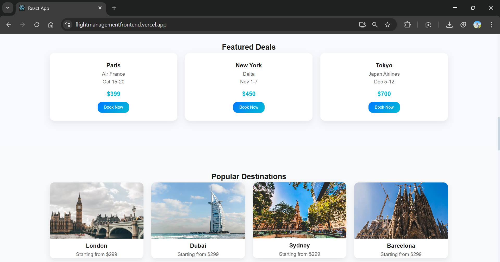
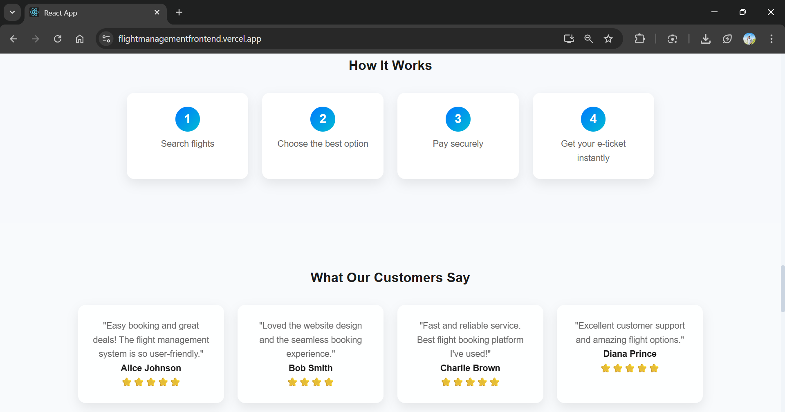

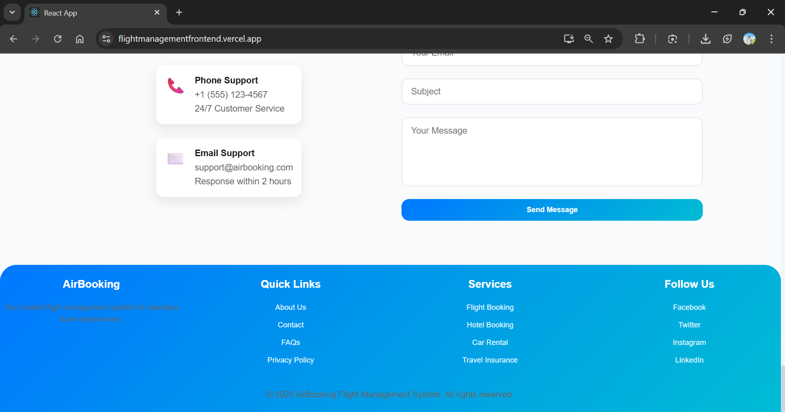

## Login Preview
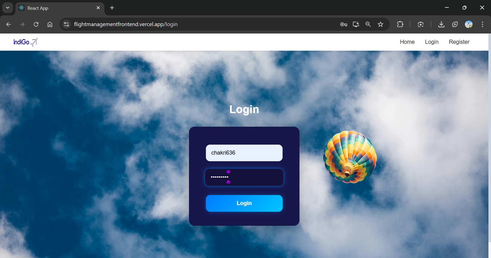
## Register Preview
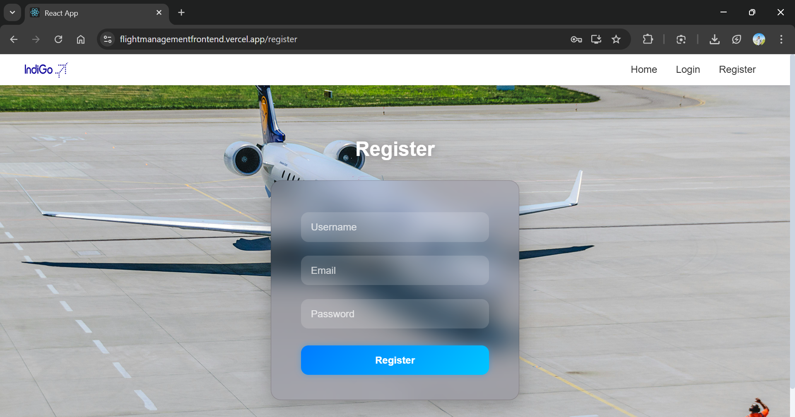

## Dashboard Preview
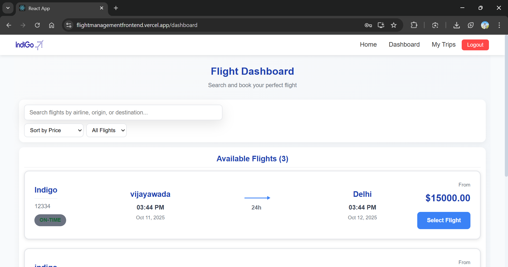

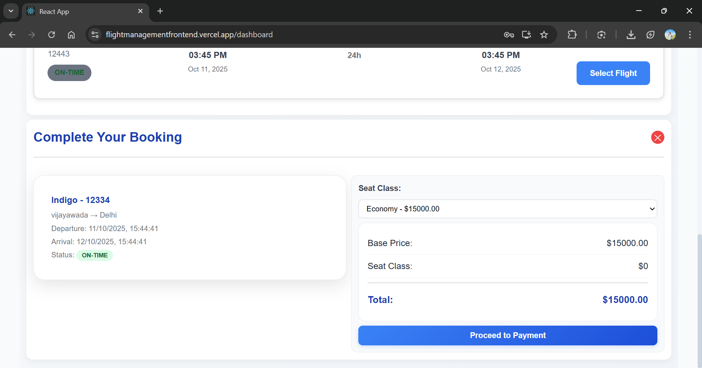

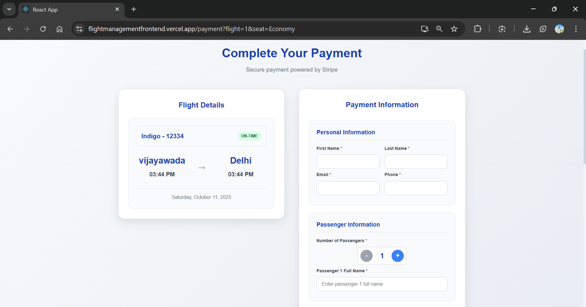
## Booking confirm
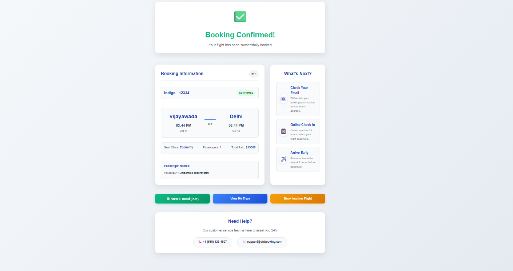


## Ticket PDF


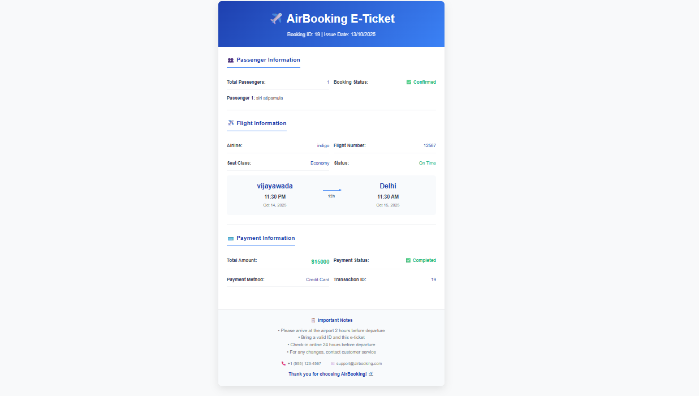
## Deploy link full stack Django + React 

https://flightmanagementfrontend.vercel.app/
---


## 📜 License
This project is for educational purposes only. Payment integration uses Stripe Test mode.
